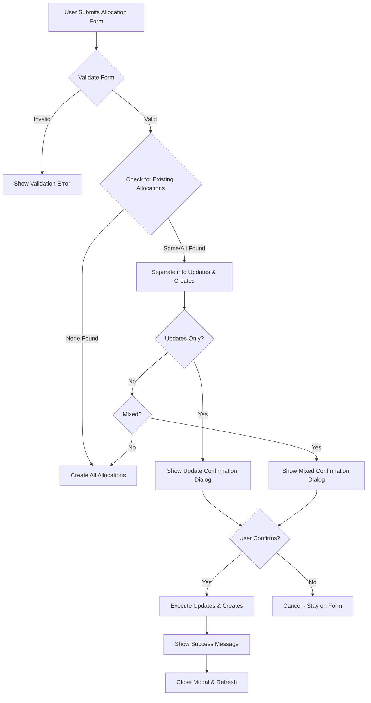

# Allocation Update Instead of Duplicate Feature

## Overview
Enhanced the allocation creation process to intelligently **update existing allocations** instead of creating duplicates when an allocation already exists for the same employee, project, and week.

## Problem Solved
**Before**: If you tried to create an allocation for an employee who already had an allocation for the same project and week, the system would:
- Show a warning message
- Prevent creation
- Force you to manually find and edit the existing allocation

**After**: The system now:
- Detects existing allocations automatically
- Shows a user-friendly confirmation dialog
- Updates existing allocations with new hours
- Creates new allocations for employees without existing ones
- Handles mixed scenarios (some updates, some creates) gracefully

## Implementation Details

### 1. Smart Duplicate Detection
The system checks for duplicates by matching:
- `projectId` (same project)
- `userId` (same employee)
- `weekStartDate` (same week start)
- `weekEndDate` (same week end)

### 2. Three Scenarios Handled

#### Scenario A: All Updates (No New Allocations)
When all selected employees already have allocations:
```
Dialog Title: "Update Existing Allocations?"
Message: "Allocation(s) already exist for the selected employee(s). Do you want to update them with the new hours?"
Details: 
  - John Doe: 40 hours
  - Jane Smith: 35 hours
Buttons: [Cancel] [Yes, Update]
```

#### Scenario B: Mixed Updates and Creates
When some employees have existing allocations and some don't:
```
Dialog Title: "Update & Create Allocations?"
Type: warning (yellow header)
Message: "Some allocations already exist. Do you want to update existing ones and create new ones?"
Details:
  - UPDATE: John Doe - 40 hours
  - UPDATE: Jane Smith - 35 hours
  - CREATE: 3 new allocation(s)
Buttons: [Cancel] [Yes, Proceed]
```

#### Scenario C: All New (No Updates)
When no existing allocations are found, proceeds directly without confirmation.

### 3. User Experience Flow



### 4. Code Changes

#### TypeScript (`allocations.component.ts`)

**Added Imports:**
```typescript
import { UpdateAllocationRequest } from '../../core/services/allocation.service';
```

**New Signals:**
```typescript
showUpdateConfirmModal = signal(false);
updateConfirmDialogData = signal<ConfirmationDialogData | null>(null);
pendingUpdateRequests = signal<{ allocationId: string; request: UpdateAllocationRequest; userName: string }[]>([]);
pendingCreateRequests = signal<CreateAllocationRequest[]>([]);
```

**Key Methods:**

1. **`onSubmit()`** - Enhanced to:
   - Separate allocations into updates vs creates
   - Show confirmation dialogs when updates are detected
   - Store pending requests in signals

2. **`executeAllocations()`** - New private method:
   - Executes both updates and creates in parallel
   - Shows appropriate success messages
   - Handles errors gracefully

3. **`onUpdateConfirmed()`** - Handles user confirmation:
   - Retrieves pending requests from signals
   - Calls `executeAllocations()`
   - Closes the confirmation dialog

4. **`closeUpdateConfirmModal()`** - Cleanup:
   - Closes dialog
   - Clears pending requests

#### HTML (`allocations.component.html`)

**Added Update Confirmation Dialog:**
```html
<app-confirmation-dialog
  *ngIf="updateConfirmDialogData()"
  [visible]="showUpdateConfirmModal()"
  [data]="updateConfirmDialogData()!"
  (confirmed)="onUpdateConfirmed()"
  (cancelled)="closeUpdateConfirmModal()">
</app-confirmation-dialog>
```

### 5. Benefits

✅ **Better UX**: No more manual searching for existing allocations to update
✅ **Time Saver**: Update multiple allocations in one action
✅ **Error Prevention**: Reduces duplicate allocations
✅ **Transparency**: Clear confirmation dialogs explain what will happen
✅ **Flexibility**: Handles mixed scenarios (updates + creates)
✅ **Consistent UI**: Uses the same reusable confirmation component

### 6. Success Messages

The system shows different messages based on the operation:

| Scenario | Message |
|----------|---------|
| Only Creates | `X allocation(s) created successfully` |
| Only Updates | `X allocation(s) updated successfully` |
| Mixed | `X allocation(s) updated and Y allocation(s) created successfully` |

### 7. Error Handling

- **409 Conflict**: "Error: Duplicate allocation detected. Please refresh and try again."
- **Other Errors**: "Error processing allocations: [error message]"
- Console logging for debugging

## Testing Checklist

- [ ] Create allocation for new employee (no existing) → Should create directly
- [ ] Create allocation for employee with existing allocation → Should show update confirmation
- [ ] Confirm update → Should update successfully
- [ ] Cancel update → Should stay on form without changes
- [ ] Create allocations for mixed group (some existing, some new) → Should show mixed confirmation
- [ ] Multi-month week with existing allocations → Should handle each period correctly
- [ ] Verify success messages are appropriate
- [ ] Verify error handling works correctly

## Future Enhancements

1. **Batch Update Optimization**: Optimize API calls for bulk updates
2. **History Tracking**: Show allocation change history
3. **Diff View**: Show old vs new hours in confirmation dialog
4. **Undo Capability**: Allow reverting recent updates
5. **Smart Suggestions**: Suggest hours based on previous weeks

## Related Files

- `frontend/onedc/src/app/features/allocations/allocations.component.ts`
- `frontend/onedc/src/app/features/allocations/allocations.component.html`
- `frontend/onedc/src/app/core/services/allocation.service.ts`
- `frontend/onedc/src/app/shared/components/confirmation-dialog.component.ts`

---
**Created**: November 4, 2025
**Feature**: Auto-update existing allocations instead of creating duplicates
